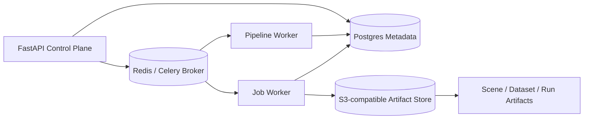
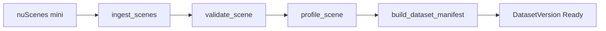
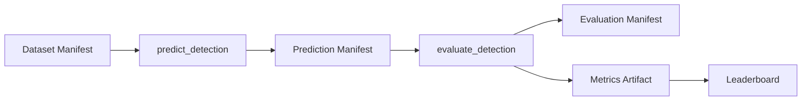

# SceneOps Platform

## Overview

SceneOps Platform is a local-first MLOps and data platform for robotics and autonomous-driving scene data. It converts scene-aware sensor datasets into structured SceneOps scene manifests, runs validation and profiling pipelines, executes detection inference and evaluation pipelines, and tracks all metadata and artifacts through an API control plane and an asynchronous worker data plane.

Managing sensor datasets for robotics and AV development involves more than storing files. Raw scene data needs to be ingested into a consistent schema, validated for quality, profiled for coverage and annotation statistics, and then tracked through the full inference and evaluation lifecycle.

SceneOps Platform addresses this by separating concerns into:

- A **control plane** (FastAPI API) that manages jobs, pipelines, metadata, and artifact records
- A **data plane** (Celery workers) that executes pipelines and jobs, checkpoints run state, and writes artifacts
- A **metadata store** (PostgreSQL) that persists all run records, artifact URIs, and leaderboard entries
- An **artifact store** (S3-compatible MinIO locally) that stores scene manifests, evaluation outputs, and metric payloads outside the database

---

## Current Validated Flows

### 1. Dataset Scene Ingestion

Pipeline: `dataset_scene_ingestion`

```text
ingest_scenes → validate_scene → profile_scene → build_dataset_manifest
```

Validated with nuScenes mini:

```
10 scenes ingested
404 samples processed
scene manifests created
dataset manifest created
validation and profile run records created
validation and profile artifacts written
dataset version ready
```

### 2. Detection Evaluation

Pipeline: `detection_evaluation`

```text
predict_detection → evaluate_detection
```

Validated with mock detector:

```
predict_detection:         succeeded
evaluate_detection:        succeeded
prediction_count:          12544
ground_truth_count:        14982
primary_metric_name:       precision
primary_metric_value:      ≈ 0.991948
evaluation_unit:           annotation
prediction manifest artifact created
predictions root artifact created
evaluation manifest artifact created
metrics artifact created
leaderboard entry created
```

> The mock detector validates orchestration, artifact tracking, run persistence, and metric aggregation. It is not a real model-quality benchmark.

---

## Architecture



### Control Plane: API

`apps/api`

The API server exposes a REST control plane for managing all platform resources.

**Structure:**

| Layer | Modules |
|---|---|
| `platform/` | `jobs`, `pipelines`, `executions`, `artifacts` |
| `domains/` | `datasets`, `scenes`, `models`, `inference`, `evaluations`, `labels` |
| `views/` | `operations`, `leaderboards` |

**Responsibilities:**

- Create, list, and read jobs and pipeline runs
- Dispatch jobs and pipelines through the Celery execution backend
- Expose dataset, scene, model, and run records
- Expose artifact records (URIs, ownership, metadata)
- Serve operations summaries and detection leaderboards

### Data Plane: Worker

`apps/worker`

The worker data plane executes all pipeline and job work asynchronously via Celery.

**Responsibilities:**

- Execute jobs and pipelines inside a `WorkerContext` with session-scoped stores
- Run `PipelineRunner` (orchestration) and `JobRunner` (individual job execution)
- Checkpoint job and pipeline state transitions (RUNNING → SUCCEEDED / FAILED)
- Write artifacts to the artifact store
- Handle scene ingestion, validation, profiling, detection inference, and evaluation

**Implementation notes:**

- Each Celery task spawns a fresh thread with an `AsyncRuntimeRunner` to isolate SQLAlchemy async event loops from Celery's prefork process model.
- Worker sessions do not auto-commit; job and pipeline lifecycle checkpoints commit state transitions explicitly.
- `RunRecordHandler` owns domain run record lifecycle: RUNNING → SUCCEEDED / FAILED.

### Core Contracts

`packages/sceneops-core`

Shared domain contracts used by both API and worker:

- Records, manifests, run records
- Job params and results
- Pipeline definitions and results
- Artifact refs and records
- Enums and domain constants

Does not include API-only response wrappers, operations dashboard wrappers, or leaderboard API wrappers.

### Metadata Store

`packages/sceneops-db`

- SQLAlchemy 2.0 async models
- Domain-owned run tables (no central generic runs table)
- Postgres repository implementations with repository protocol interfaces
- Alembic migrations
- Artifact records stored separately from artifact content (DB stores URIs, summaries, and metadata only)

### Artifact Storage

`packages/sceneops-storage`

- Storage abstraction supporting local filesystem and S3-compatible backends
- Large artifact content (manifests, predictions, metrics) stored outside the DB
- Backend switchable via `.env.local`:

```bash
# Local filesystem
SCENEOPS_WORKER_ARTIFACT__BACKEND=local
SCENEOPS_WORKER_ARTIFACT__ROOT_URI=/data

# MinIO / S3
SCENEOPS_WORKER_ARTIFACT__BACKEND=minio
SCENEOPS_WORKER_ARTIFACT__ROOT_URI=s3://sceneops
SCENEOPS_WORKER_ARTIFACT__ENDPOINT_URL=http://minio:9000
```

---

## Execution Model

Jobs and pipelines are dispatched from the API and executed on separate Celery queues:

| Queue | Worker | Concurrency | Purpose |
|---|---|---|---|
| `sceneops.pipeline_runs` | `worker-pipeline` | 1 (default) | Pipeline orchestration, step sequencing |
| `sceneops.jobs` | `worker-jobs` | 4 (default) | Individual job execution |

Concurrency is configurable via environment variables:

```bash
SCENEOPS_WORKER_PIPELINE_CONCURRENCY=1
SCENEOPS_WORKER_JOBS_CONCURRENCY=4
```

---

## Artifact Model

Artifact content lives in the artifact store (local or MinIO). The database stores URIs, ownership, summaries, and metadata.

**Current artifact stores:**

| Store | Artifacts |
|---|---|
| `DatasetArtifactStore` | Dataset manifest, dataset-level artifacts |
| `SceneArtifactStore` | Scene manifest, scene sample iteration |
| `RunArtifactStore` | Prediction manifest, predictions root, evaluation manifest, metrics, validation report, profile report |
| `ObservationArtifactStore` | Raw-log artifact scaffold (future use) |

---

## Pipelines and Jobs

### Current built-in pipelines

```
dataset_scene_ingestion
  ingest_scenes → validate_scene → profile_scene → build_dataset_manifest

detection_evaluation
  predict_detection → evaluate_detection
```

### Validated active jobs

| Job | Pipeline |
|---|---|
| `ingest_scenes` | `dataset_scene_ingestion` |
| `validate_scene` | `dataset_scene_ingestion` |
| `profile_scene` | `dataset_scene_ingestion` |
| `build_dataset_manifest` | `dataset_scene_ingestion` |
| `predict_detection` | `detection_evaluation` |
| `evaluate_detection` | `detection_evaluation` |

### Planned pipelines (roadmap)

```
raw_log_scene_building
scene_reconstruction
scene_registration
scenario_curation
generated_dataset_preparation
```

### Planned jobs (roadmap)

```
build_scenes
register_scene
compare_scenes
mine_scenarios
score_scenario_readiness
auto_label_scene
auto_label_dataset
export_dataset
```

---

## Repository Structure

```
sceneops-platform/
├── apps/
│   ├── api/                        # FastAPI control plane
│   │   └── app/
│   │       ├── platform/           # jobs, pipelines, executions, artifacts
│   │       ├── domains/            # datasets, scenes, models, inference, evaluations, labels
│   │       └── views/              # operations, leaderboards
│   ├── inference-server/           # GroundingDINO inference server (FastAPI, port 8001)
│   └── worker/                     # Celery execution runtime
│       └── sceneops_worker/
│           ├── pipelines/          # PipelineRunner, StepExecutor
│           ├── jobs/               # job handlers by domain
│           ├── stores/             # session-scoped data stores
│           ├── datasets/           # nuScenes ingestion
│           ├── inference/          # Mock / ONNX / GroundingDINO backends
│           ├── evaluation/         # detection metrics
│           └── runs/               # run artifact I/O
├── packages/
│   ├── sceneops-core/              # domain contracts, Pydantic schemas, constants
│   ├── sceneops-db/                # SQLAlchemy models, async repositories, migrations
│   └── sceneops-storage/           # LocalArtifactStore, S3ArtifactStore
├── migrations/                     # Alembic migrations
├── scripts/
│   ├── e2e/                        # E2E test scripts
│   ├── fixtures/                   # nuScenes dataset registration
│   ├── checks/                     # environment and health checks
│   ├── debug/                      # pipeline/job inspection scripts
│   └── init/                       # MinIO initialization
├── docker-compose.local.yml
├── Makefile
└── pyproject.toml                  # uv workspace (Python 3.11–3.12)
```

---

## Quickstart

**Requirements:**

- Docker and Docker Compose
- [uv](https://github.com/astral-sh/uv) (Python workspace manager)
- Python 3.11 or 3.12
- nuScenes mini data mounted under `./data/raw/nuscenes`

**Setup:**

```bash
# 1. Create .env.local (copy from .env.example and adjust as needed)
cp .env.example .env.local

# 2. Install dependencies and pre-commit hooks
make setup

# 3. Start full local stack (MinIO + DB migrations + API + workers)
make local-up

# 4. Register the nuScenes dataset
make register-nuscenes-dataset

# 5. Run all E2E tests
make e2e
```

`make local-up` starts MinIO, runs Alembic migrations, then starts the API and both workers.

**Stop all services:**

```bash
make local-down
```

---

## Makefile Commands

### Stack management

| Command | Description |
|---|---|
| `make setup` | Install dependencies and pre-commit hooks |
| `make local-up` | Start full local stack (MinIO + migrate + API + workers) |
| `make local-down` | Stop all services |
| `make local-reset` | Wipe volumes and restart from scratch |
| `make local-logs` | Follow logs for all main services |
| `make local-ps` | Show service status |

### Database

| Command | Description |
|---|---|
| `make db-migrate` | Build migrate image and run Alembic upgrade head |
| `make db-revision MSG='...'` | Generate a new Alembic revision |
| `make db-current` | Show current migration head |
| `make db-history` | Show migration history |
| `make db-reset` | Drop volumes and re-migrate |
| `make db-shell` | Open psql shell |

### API

| Command | Description |
|---|---|
| `make api-logs` | Follow API container logs |
| `make api-health` | Hit `/health` endpoint |
| `make api-openapi` | Validate OpenAPI schema generation |

### Worker

| Command | Description |
|---|---|
| `make worker-logs` | Follow pipeline and jobs worker logs |
| `make worker-imports` | Validate worker package imports and job registry |
| `make worker-cli` | Run worker CLI (help) |
| `make worker-run-job JOB_ID=...` | Run a specific job directly |
| `make worker-run-pipeline PIPELINE_RUN_ID=...` | Run a specific pipeline directly |

### E2E

| Command | Description |
|---|---|
| `make e2e` | Run all E2E tests |
| `make e2e-api-smoke` | API smoke test |
| `make e2e-dataset-scene-ingestion` | Dataset ingestion pipeline E2E |
| `make e2e-detection-evaluation` | Detection evaluation pipeline E2E |

### Debug

| Command | Description |
|---|---|
| `make show-runs` | List recent runs via API |
| `make show-pipeline PIPELINE_RUN_ID=...` | Show pipeline run detail |
| `make show-job-events JOB_ID=...` | Show job event log |
| `make tail-worker-logs` | Tail combined worker logs |

### MinIO

| Command | Description |
|---|---|
| `make minio-up` | Start MinIO and run bucket init |
| `make minio-down` | Stop and remove MinIO |
| `make minio-logs` | Follow MinIO logs |
| `make minio-console` | Print MinIO API and console URLs |
| `make check-minio` | Health check MinIO |

---

## E2E Validation

The E2E suite covers three flows:

**1. API smoke (`e2e-api-smoke`)** — verifies the API is reachable and returns expected responses for core endpoints.

**2. Dataset scene ingestion (`e2e-dataset-scene-ingestion`):**



**3. Detection evaluation (`e2e-detection-evaluation`):**



Previous E2E results were confirmed passing. Makefile targets were dry-run validated (`make -n local-up`, `make -n e2e`) in the current state of the repo.

---

## Current Limitations

- The detection E2E uses a mock detector. It validates orchestration and metric plumbing, not real model quality.
- Raw-log scene building and reconstruction are planned but not fully implemented.
- Auto-labeling is intentionally disabled pending a `labeler_id`-based rewrite.
- `ObservationArtifactStore` is scaffolded for future raw-log ingestion.
- The inference server (GroundingDINO) is present but gated behind optional Docker Compose profiles (`inference` for CPU, `gpu` for NVIDIA GPU). It is not required for the validated E2E flows.
- The platform is local-first and intended for architecture validation and portfolio demonstration.

---

## Roadmap

- Raw-log / ROS bag scene building pipeline
- Dataset sample index artifact
- Scenario mining and readiness scoring
- Auto-labeling with `labeler_id`-based `LabelerRegistry`
- Real detector integration through inference server
- Dataset export for generated and reconstructed scenes
- Airflow orchestration backend integration
- Cloud object storage support beyond local MinIO

---

## Tech Stack

| Layer | Technology |
|---|---|
| API | FastAPI, Pydantic v2, Uvicorn |
| Task queue | Celery, Redis 7 |
| Database | PostgreSQL 16, SQLAlchemy 2.0 (async), Alembic |
| Artifact storage | MinIO (S3 API), boto3 |
| Inference (optional) | GroundingDINO (HuggingFace Transformers), ONNX Runtime |
| Scene data | nuScenes DevKit |
| Package management | uv workspace |
| Code quality | Ruff, pre-commit |
| Infra | Docker Compose |
