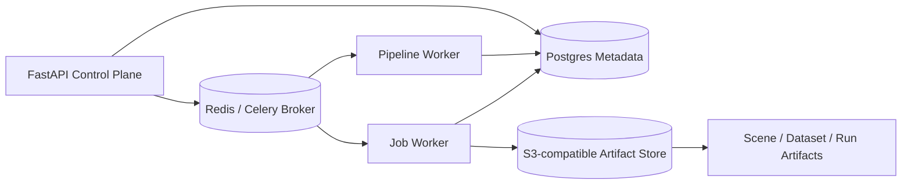
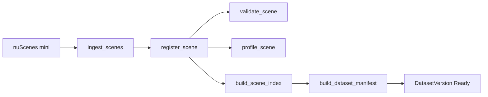
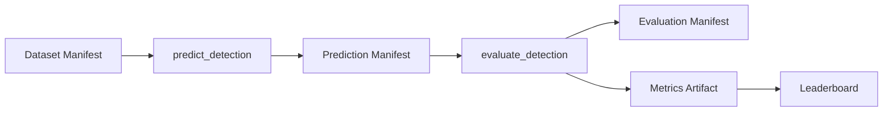

# SceneOps Platform

## Overview

SceneOps Platform is a local-first MLOps and data platform for robotics and autonomous-driving scene data. It converts scene-aware sensor datasets into structured SceneOps scene manifests, runs validation and profiling pipelines, executes detection inference and evaluation pipelines, and tracks all metadata and artifacts through an API control plane and an asynchronous worker data plane.

Managing sensor datasets for robotics and AV development involves more than storing files. Raw scene data needs to be ingested into a consistent schema, validated for quality, profiled for coverage and annotation statistics, and then tracked through the full inference and evaluation lifecycle.

SceneOps Platform addresses this by separating concerns into:

- A **control plane** (FastAPI API) that manages jobs, pipelines, metadata, and artifact records
- A **data plane** (Celery workers) that executes pipelines and jobs, checkpoints run state, and writes artifacts
- A **metadata store** (PostgreSQL) that persists all run records, artifact URIs, and leaderboard entries
- An **artifact store** (S3-compatible MinIO locally) that stores scene manifests, evaluation outputs, and metric payloads outside the database

---

## Current Validated Flows

### 1. Dataset Scene Ingestion

Pipeline: `dataset_scene_ingestion`

```text
ingest_scenes → register_scene → validate_scene → profile_scene → build_scene_index → build_dataset_manifest
```

Validated with nuScenes mini:

```
10 scenes ingested
404 samples processed
scene manifests created
dataset manifest created
validation and profile run records created
validation and profile artifacts written
dataset version ready
```

### 2. Detection Evaluation

Pipeline: `detection_evaluation`

```text
predict_detection → evaluate_detection
```

Validated with mock detector:

```
predict_detection:         succeeded
evaluate_detection:        succeeded
prediction_count:          12544
ground_truth_count:        14982
primary_metric_name:       precision
primary_metric_value:      ≈ 0.991948
evaluation_unit:           annotation
prediction manifest artifact created
predictions root artifact created
evaluation manifest artifact created
metrics artifact created
leaderboard entry created
```

> The mock detector validates orchestration, artifact tracking, run persistence, and metric aggregation. It is not a real model-quality benchmark.

---

## Architecture



### Control Plane: API

`apps/api`

The API server exposes a REST control plane for managing all platform resources.

**Structure:**

| Layer | Modules |
|---|---|
| `platform/` | `jobs`, `pipelines`, `executions`, `artifacts` |
| `domains/` | `datasets`, `scenes`, `models`, `inference`, `evaluations`, `labels` |
| `views/` | `operations`, `leaderboards` |

**Responsibilities:**

- Create, list, and read jobs and pipeline runs
- Dispatch jobs and pipelines through the Celery execution backend
- Expose dataset, scene, model, and run records
- Expose artifact records (URIs, ownership, metadata)
- Serve operations summaries and detection leaderboards

### Data Plane: Worker

`apps/worker`

The worker data plane executes all pipeline and job work asynchronously via Celery.

**Responsibilities:**

- Execute jobs and pipelines inside a `WorkerContext` with session-scoped stores
- Checkpoint job and pipeline state transitions (RUNNING → SUCCEEDED / FAILED)
- Write artifacts to the artifact store
- Handle scene ingestion, validation, profiling, detection inference, and evaluation

**Pipeline execution architecture:**

```
PipelineRunner              (local Celery orchestrator)
└── PipelineTaskRunner      (single task use case — also the Airflow task entry point)
    ├── PipelineInputResolver   → resolves PipelineTaskInputs from DB records
    ├── PipelineJobPlanner      → builds JobManifest from PipelineTaskInputs
    ├── JobRunner               → executes the concrete job by job_id (pipeline-agnostic)
    ├── PipelineTaskResultRecorder → persists normalized PipelineTaskResult to DB
    ├── PipelineTaskResultBuilder  → splits raw handler output into refs/summary/raw_result
    └── PipelineQualityGate     → validates result against task contract
```

Each pipeline task can be executed as a standalone invocation:

```bash
sceneops-worker run-pipeline-task \
  --pipeline-run-id <id> \
  --task-id <task_id>
```

This is the Airflow-compatible entry point. A future Airflow DAG, DockerOperator, or KubernetesPodOperator will call this command for each task — the container exit code reflects success (0) or failure (non-zero).

**`PipelineTaskInputs` — compact reference envelope:**

```
PipelineTaskInputs
  pipeline       — stable task-level identity (pipeline_run_id, task_id, ...)
  dataset        — DatasetInputRef (identity + baseline quality-cache refs)
  model          — ModelInputRef (identity + URI + backend + runtime)
  upstream_tasks — PipelineUpstreamTaskRef per upstream task (refs/summary/raw_result)
  refs           — merged URIs and IDs from upstream task results
  summary        — merged counts, status flags, and metric summaries from upstream tasks
  params         — explicit task-level params
  extra          — caller-supplied overrides
```

`PipelineInputResolver` resolves this from DB records (DatasetVersionRecord, ModelVersionRecord, upstream PipelineTaskRun.result) — no in-memory context propagation.

**`PipelineTaskResult` — normalized output:**

```
PipelineTaskResult
  refs        — downstream-input-oriented IDs and URIs (read by PipelineInputResolver)
  summary     — counts, status flags, metric summaries
  raw_result  — full handler output for debugging
```

`PipelineTaskResultRecorder` splits the raw job handler output into these three buckets using `_REFS_KEYS` / `_SUMMARY_KEYS` and job-type-specific alias normalization (e.g., `report_uri → validation_report_uri` for `validate_scene`).

**Implementation notes:**

- Each Celery task spawns a fresh thread with an `AsyncRuntimeRunner` (`runtime/`) to isolate SQLAlchemy async event loops from Celery's prefork process model.
- Worker sessions do not auto-commit; job and pipeline lifecycle checkpoints commit state transitions explicitly.
- `RunRecordHandler` owns domain run record lifecycle: RUNNING → SUCCEEDED / FAILED.
- `PipelineRunner` iterates `PipelineDefinition.tasks` (sorted by `task.order`) and delegates each task to `PipelineTaskRunner`. Final `PipelineRunResult` is aggregated from persisted `PipelineTaskRun.result` records — no in-memory value propagation.
- `WorkerContext` and `RunStores` are defined in `core/` and injected into job handlers via `core/dependencies.py`.
- Celery task wiring lives in `tasks/` (`jobs.py`, `pipelines.py`); Celery app factory and job dispatch/watch utilities live in `execution/`.

### Core Contracts

`packages/sceneops-core`

Shared domain contracts used by both API and worker:

- Records, manifests, run records
- Job params and results
- Pipeline definitions and results
- Artifact refs and records
- Enums and domain constants

Does not include API-only response wrappers, operations dashboard wrappers, or leaderboard API wrappers.

### Metadata Store

`packages/sceneops-db`

- SQLAlchemy 2.0 async models
- Domain-owned run tables (no central generic runs table)
- Postgres repository implementations with repository protocol interfaces
- Alembic migrations
- Artifact records stored separately from artifact content (DB stores URIs, summaries, and metadata only)

### Artifact Storage

`packages/sceneops-storage`

- Storage abstraction supporting local filesystem and S3-compatible backends
- Large artifact content (manifests, predictions, metrics) stored outside the DB
- Backend switchable via `.env.local`:

```bash
# Local filesystem
SCENEOPS_WORKER_ARTIFACT__BACKEND=local
SCENEOPS_WORKER_ARTIFACT__ROOT_URI=/data

# MinIO / S3
SCENEOPS_WORKER_ARTIFACT__BACKEND=minio
SCENEOPS_WORKER_ARTIFACT__ROOT_URI=s3://sceneops
SCENEOPS_WORKER_ARTIFACT__ENDPOINT_URL=http://minio:9000
```

---

## Execution Model

### Local / Celery mode

Jobs and pipelines are dispatched from the API and executed on separate Celery queues:

| Queue | Worker | Concurrency | Purpose |
|---|---|---|---|
| `sceneops.pipeline_runs` | `worker-pipeline` | 1 (default) | Pipeline orchestration via `PipelineRunner` |
| `sceneops.jobs` | `worker-jobs` | 4 (default) | Individual job execution via `JobRunner` |

Concurrency is configurable via environment variables:

```bash
SCENEOPS_WORKER_PIPELINE_CONCURRENCY=1
SCENEOPS_WORKER_JOBS_CONCURRENCY=4
```

### Standalone task mode (Airflow-compatible)

Each pipeline task can be executed independently using the worker CLI:

```bash
sceneops-worker run-pipeline-task \
  --pipeline-run-id <pipeline_run_id> \
  --task-id <task_id>
```

This invokes `PipelineTaskRunner.run(pipeline_run_id, task_id)` directly. It resolves all inputs from DB records, executes the job, and writes the normalized result back to DB — with no dependency on in-memory context from other tasks.

The exit code is 0 on success and non-zero on failure, making it suitable as a DockerOperator or KubernetesPodOperator command in Airflow. A future Airflow DAG will call this command once per task, replacing the local `PipelineRunner` for cloud-scale orchestration.

---

## Artifact Model

Artifact content lives in the artifact store (local or MinIO). The database stores URIs, ownership, summaries, and metadata.

**Current artifact stores:**

| Store | Artifacts |
|---|---|
| `DatasetArtifactStore` | Dataset manifest, dataset-level artifacts |
| `SceneArtifactStore` | Scene manifest, scene sample iteration |
| `RunArtifactStore` | Prediction manifest, predictions root, evaluation manifest, metrics, validation report, profile report |
| `ObservationArtifactStore` | Raw-log artifact scaffold (future use) |

---

## Pipelines and Jobs

### Current built-in pipelines

```
dataset_scene_ingestion
  ingest_scenes → register_scene → validate_scene → profile_scene
  → build_scene_index → build_dataset_manifest

raw_log_scene_building
  build_scenes → register_scene → validate_scene → profile_scene
  → build_scene_index → build_dataset_manifest

detection_evaluation
  predict_detection → evaluate_detection
```

### Validated active jobs

| Job | Pipeline |
|---|---|
| `ingest_scenes` | `dataset_scene_ingestion` |
| `build_scenes` | `raw_log_scene_building` |
| `register_scene` | both scene pipelines |
| `validate_scene` | both scene pipelines |
| `profile_scene` | both scene pipelines |
| `build_scene_index` | both scene pipelines |
| `build_dataset_manifest` | both scene pipelines |
| `predict_detection` | `detection_evaluation` |
| `evaluate_detection` | `detection_evaluation` |

### raw_log_scene_building modes

`raw_log_scene_building` supports two segmentation/sampling modes:

**1. Sequence / frame-id mode** (`segmentation.strategy=sequence`, `sampling.strategy=frame_id`)

Uses `source_sequence_id` / `source_scene_id` hints to group raw frames into scene segments,
and `source_frame_id` / `source_sample_id` hints to group frames into samples within each scene.
In the local nuScenes mock, nuScenes scene and sample tokens are mapped into these generic
sequence and frame hint fields — the public strategy names remain raw-log-agnostic.

**2. Timestamp reconstruction mode** (`segmentation.strategy=fixed_window`, `sampling.strategy=time_bucket`)

Reconstructs scenes and samples purely from raw sensor observation timestamps,
without using any source scene/sample hints.

- `fixed_window` splits frames into equal-duration time windows (e.g. 2 s).
  The `scene_segment_index` artifact records all segment boundaries with
  generated SceneOps IDs (`{raw_log_id}-fwXXXX`).
- `time_bucket` groups frames within each segment into sample buckets by timestamp
  (e.g. 500 ms), with generated sample IDs (`{scene_id}-sample-XXXXXX`).

**Scene count params**

- `max_source_sequences`: limits how many source sequences the adapter reads.
- `max_built_scenes`: caps the number of output SceneOps scenes after segmentation.

**Validation**

Validation separates scene-level channel coverage (blocking by default) from sample-level
missing channels. Set `sample_validation.block_on_sample_missing_channels: true` in
`validate_scene` params to make sample-level missing channels blocking.

### Planned pipelines (roadmap)

```
scene_reconstruction           (defined, not yet implemented)
scene_registration             (defined, not yet implemented)
scenario_curation
generated_dataset_preparation
```

### Planned jobs (roadmap)

```
compare_scenes
mine_scenarios
score_scenario_readiness
auto_label_scene
auto_label_dataset
export_dataset
```

---

## Repository Structure

```
sceneops-platform/
├── apps/
│   ├── api/                        # FastAPI control plane
│   │   └── app/
│   │       ├── platform/           # jobs, pipelines, executions, artifacts
│   │       ├── domains/            # datasets, scenes, models, inference, evaluations, labels
│   │       └── views/              # operations, leaderboards
│   ├── inference-server/           # GroundingDINO inference server (FastAPI, port 8001)
│   └── worker/                     # Celery execution runtime
│       └── sceneops_worker/
│           ├── pipelines/          # PipelineRunner, PipelineTaskRunner, InputResolver,
│           │                       #   JobPlanner, ResultBuilder, ResultRecorder, QualityGate
│           ├── jobs/               # job handlers by domain (dataset/, evaluation/,
│           │                       #   inference/, labeling/, simulation/)
│           ├── core/               # WorkerContext, RunStores, dependency injection
│           ├── execution/          # Celery app factory, job dispatcher, job watcher
│           ├── tasks/              # Celery task definitions (jobs.py, pipelines.py)
│           ├── runtime/            # AsyncRuntimeRunner (async event-loop isolation)
│           ├── scenes/             # scene validation, profiling, raw scene builder,
│           │                       #   sample grouping, scene artifacts
│           ├── stores/             # session-scoped data stores
│           ├── datasets/           # nuScenes ingestion
│           ├── inference/          # Mock / ONNX / GroundingDINO backends
│           ├── evaluation/         # detection metrics
│           ├── runs/               # run artifact I/O
│           ├── tools/              # dataset/scene adapters and artifact utilities
│           └── observations/       # raw-log observation artifact scaffold (future use)
├── packages/
│   ├── sceneops-core/              # domain contracts, Pydantic schemas, constants
│   ├── sceneops-db/                # SQLAlchemy models, async repositories, migrations
│   └── sceneops-storage/           # LocalArtifactStore, S3ArtifactStore
├── migrations/                     # Alembic migrations
├── scripts/
│   ├── e2e/                        # E2E test scripts
│   ├── fixtures/                   # nuScenes dataset registration
│   ├── checks/                     # environment and health checks
│   ├── debug/                      # pipeline/job inspection scripts
│   ├── dev/                        # local dev utilities (reset_local_state.sh)
│   └── init/                       # MinIO initialization
├── docker-compose.local.yml
├── Makefile
└── pyproject.toml                  # uv workspace (Python 3.11–3.12)
```

---

## Quickstart

**Requirements:**

- Docker and Docker Compose
- [uv](https://github.com/astral-sh/uv) (Python workspace manager)
- Python 3.11 or 3.12
- nuScenes mini data mounted under `./data/raw/nuscenes`

**Setup:**

```bash
# 1. Create .env.local (copy from .env.example and adjust as needed)
cp .env.example .env.local

# 2. Install dependencies and pre-commit hooks
make setup

# 3. Start full local stack (MinIO + DB migrations + API + workers)
make local-up

# 4. Register the nuScenes dataset
make register-nuscenes-dataset

# 5. Run all E2E tests
make e2e
```

`make local-up` starts MinIO, then starts Postgres, Redis, the API, and both workers. Run `make db-migrate` separately before `make local-up` if the database has not been migrated yet.

**Stop all services:**

```bash
make local-down
```

---

## Makefile Commands

### Setup / Quality

| Command | Description |
|---|---|
| `make setup` | Install dependencies and pre-commit hooks |
| `make uv-sync` | Sync all workspace packages |
| `make uv-lock` | Update uv.lock |
| `make check` | Run pre-commit on all files |
| `make lint` | Run ruff check |
| `make format` | Run ruff format |
| `make test` | Run worker unit tests |

### Stack management

| Command | Description |
|---|---|
| `make local-up` | Start full local stack (MinIO + Postgres + Redis + API + workers) |
| `make local-down` | Stop all services |
| `make local-reset` | Wipe volumes and restart from scratch |
| `make local-logs` | Follow logs for all main services |
| `make local-ps` | Show service status |
| `make reset-local` | Reset local state (artifacts + DB) without full volume wipe |

### Database

| Command | Description |
|---|---|
| `make db-migrate` | Build migrate image and run Alembic upgrade head |
| `make db-revision MSG='...'` | Generate a new Alembic revision |
| `make db-current` | Show current migration head |
| `make db-history` | Show migration history |
| `make db-reset` | Drop volumes and re-migrate |
| `make db-shell` | Open psql shell |

### API

| Command | Description |
|---|---|
| `make api-logs` | Follow API container logs |
| `make api-shell` | Open shell in API container |
| `make api-health` | Hit `/health` endpoint |
| `make api-openapi` | Validate OpenAPI schema generation |

### Worker

| Command | Description |
|---|---|
| `make worker-logs` | Follow pipeline and jobs worker logs |
| `make worker-shell` | Open shell in worker-cli container |
| `make worker-python` | Open Python REPL in worker-cli container |
| `make worker-imports` | Validate worker package imports and job registry |
| `make worker-cli` | Run worker CLI (help) |
| `make worker-run-job JOB_ID=...` | Run a specific job directly |
| `make worker-run-pipeline PIPELINE_RUN_ID=...` | Run a specific pipeline directly |
| `make worker-run-pipeline-task PIPELINE_RUN_ID=... TASK_ID=...` | Run one pipeline task directly (Airflow-compatible entry point) |

### Checks

| Command | Description |
|---|---|
| `make check-env` | Verify environment variables |
| `make check-imports` | Validate Python package imports |
| `make check-celery` | Check Celery broker connectivity |
| `make check-minio` | Health check MinIO |

### E2E

| Command | Description |
|---|---|
| `make e2e` | Run all E2E tests (smoke + ingestion + detection + contracts) |
| `make e2e-api-smoke` | API smoke test |
| `make e2e-dataset-scene-ingestion` | Dataset ingestion pipeline E2E |
| `make e2e-detection-evaluation` | Detection evaluation pipeline E2E |
| `make e2e-pipeline-contracts` | Pipeline contract validation E2E |
| `make e2e-raw-log-scene-building` | Raw log scene building pipeline E2E (sequence/frame-id mode) |
| `make e2e-raw-log-scene-building-time-window` | Raw log scene building E2E (fixed-window/time-bucket mode) |

### Debug

| Command | Description |
|---|---|
| `make show-runs` | List recent runs via API |
| `make show-pipeline PIPELINE_RUN_ID=...` | Show pipeline run detail |
| `make show-job-events JOB_ID=...` | Show job event log |
| `make tail-worker-logs` | Tail combined worker logs |

### MinIO

| Command | Description |
|---|---|
| `make minio-up` | Start MinIO and run bucket init |
| `make minio-down` | Stop and remove MinIO |
| `make minio-logs` | Follow MinIO logs |
| `make minio-console` | Print MinIO API and console URLs |
| `make check-minio` | Health check MinIO |

---

## E2E Validation

The E2E suite covers four flows:

**1. API smoke (`e2e-api-smoke`)** — verifies the API is reachable and returns expected responses for core endpoints.

**2. Dataset scene ingestion (`e2e-dataset-scene-ingestion`):**



**3. Detection evaluation (`e2e-detection-evaluation`):**



**4. Pipeline contracts (`e2e-pipeline-contracts`)** — validates PipelineTaskInputs/PipelineTaskResult contract consistency across pipeline task runs for a given dataset version.

---

## Current Limitations

- The detection E2E uses a mock detector. It validates orchestration and metric plumbing, not real model quality.
- Raw-log scene building is implemented and E2E-validated (sequence/frame-id and fixed-window/time-bucket modes). Scene reconstruction pipeline is defined but not yet implemented (`supported=False`).
- Auto-labeling is intentionally disabled pending a `labeler_id`-based rewrite.
- `ObservationArtifactStore` is scaffolded for future raw-log ingestion.
- The inference server (GroundingDINO) is present but gated behind optional Docker Compose profiles (`inference` for CPU, `gpu` for NVIDIA GPU). It is not required for the validated E2E flows.
- The platform is local-first and intended for architecture validation and portfolio demonstration.

---

## Roadmap

- Airflow DAG integration using `sceneops-worker run-pipeline-task` as the DockerOperator / KubernetesPodOperator command
- Raw-log / ROS bag scene building pipeline
- Dataset sample index artifact
- Scenario mining and readiness scoring
- Auto-labeling with `labeler_id`-based `LabelerRegistry`
- Real detector integration through inference server
- Dataset export for generated and reconstructed scenes
- Cloud object storage support beyond local MinIO

---

## Tech Stack

| Layer | Technology |
|---|---|
| API | FastAPI, Pydantic v2, Uvicorn |
| Task queue | Celery, Redis 7 |
| Database | PostgreSQL 16, SQLAlchemy 2.0 (async), Alembic |
| Artifact storage | MinIO (S3 API), boto3 |
| Inference (optional) | GroundingDINO (HuggingFace Transformers), ONNX Runtime |
| Scene data | nuScenes DevKit |
| Package management | uv workspace |
| Code quality | Ruff, pre-commit |
| Infra | Docker Compose |
